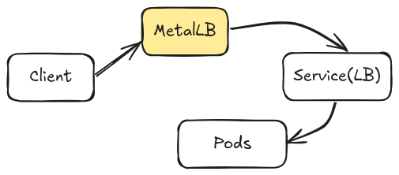
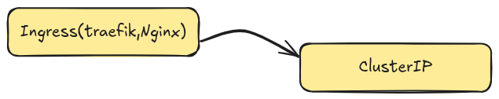
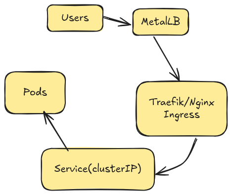

# Using the service type of loadbalacner 
when we are not working with cloud kubernetes 
you can use it own by 

## Using metallb 


Example confnig of Metal LB 
```yaml 
apiVersion: metallb.io/v1beta1
kind: IPAddressPool 
metadata: 
    name: local-pool 
spec: 
    addresses: 
    - 192.169.1.240-192.168.1.250
    
```

## Using ingress controller 


Why is this perferered ? 
- One entry point 
- TLS termination 
- Path & Domain routing 
- Lower IP usage 


### Best Architecture for On-Prem ( What props use )



*** 
## More on the ingress appraoch 
Nginx ingress use round-robin by default 

Nginx also support multiple algorithms via annotation 

- round_robin 
- least_conn: Pods have unevent workload 
- ewma : Pods have different performance 
- hash : Session affinity 
- random two least : high-traffic system 

* Least Conection n`least_con`
```yaml
metadata: 
    annotations: 
        nginx.ingress.kubernetes.io/load-balancer: "least_cont" 
```

* Using EWMA ( Exponentially Weighted Moving Average )

Nginx Tracks: 
- Response Time 
- Failture rates 

Then perfers fast pods auomatically 
```yaml 
metadata: 
    annotation: 
    nginx.ingress.kubernetes.io/load-balance: "ewma"
```

* Session-aware routing (Sticky Sessions )
Useful when : 
- WebSockets 
- Legacy apps 
- Stateful frontend sessions 

- Cookies based affinitiy 
```yaml 
metadata:  
    annotation: 
        nginx.ingress.kubernets.io/affinity : "cookie" 
        nginx.ingress.kubernetes.io/session-cookie-name: "INGRESSCOOKIES" 
```

* wEIGHTED LOAD BALANCER 
```yaml 
nginx.ingress.kubernetes.io/upstream-hash-by: "$request_uri"

```

There is a issue 

## Why MetalLB Pools works ( or Doesn't )
MetalLB requirements (L2Mode)
- IP must be 
    - in the same layer2 network as the node
    - Unusednot assigned to any VM, router, or services ) 
- Traffic delivered via ARP / NDP 

### Why MetalLB MOde Doesn't Work on GCP 
Google CLoud: '
- DOesn't allow ARP broadcasting 
- Deson't allow IP takeover 
- Assigns IP via VPC routing , Not L2 

Note that 👍
- MetalLB is for bare-metal kuberneteds 
- MetalLB is not for GKE/ GCP public Traffic. 


MetalLB Layer2 mode requires: 
- ARP broadcasting 
- IP takeover ( one node answering for an IPT doens't own )
- A flat layer2 network. 


Google VCP doesn't allow: 
- ARP broadcasting 
- VRRP 
- FLoating IPs 
- Gratuitous ARP 
- IP ownershipt change between VM. 


## When HAProxy + Keepalived is GOOD solutions 
- Works well in : 
    - bare-metal kubernetes 
    - on-prem data centers
    - Home labs 
    - VMs on network where you control the layer2
    - Environments without a cloud load balancer 


- Why it works here : 
    - Keepalived use VRRP to move a Virutal IP (VIP ) between machines 
    - HAProxy listens on that VIP 
    - If one LB node dies -> VIP move -> traffic continues. 