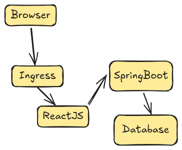

1. Postgresql deployment 
### Option A: Production Setup 
Use: 
- CloudNativePG
- Crunchy Postgresql for KUbernetes
- Or manage cloudDB (RDS , CloudSQL, etc )

This gives: 
- HA 
- Backup 
- Failover 
- Replication   

### Option B: Development SETUP
Use
- Deployment or Statefulset 
- Expose the service internally with the `ClusterIP` -> `postgres-svc.default.svc.cluster.local`

- Spring connect using only 
`jdbc:postgresql://postgres-svc:5432/your-db`


A. We can use Port Forward ( safer for Dev )
- Local Debuggin g 
- Temporary access 

Command 
```bash 
kubectl port-forward svc/postgres-service 5432:5432 
```
B. NodePort(Not recommended for productions )
C. Best Production Way (Recommended )
- Keep Postgresql internal (ClusterIP only )
- DO NOT expose database to the internet 

Instead: 
- Use VPN access to the cluster network
- or SSH tunnel through -bastion- host 
- Or Connect through the Jump Server 

Example SSH tunnel: 
```bash
ssh -L 5432:postgres-svc:5432 user@bastion-server
```
Then connect with the DataGrip 
```bash 
localhost:5432
```


*** 
Installing helm 

```bash 
curl -fsSL -o get_helm.sh https://raw.githubusercontent.com/helm/helm/main/scripts/get-helm-4
chmod 700 get_helm.sh
./get_helm.sh

```
- https://helm.sh/docs/intro/install/ 