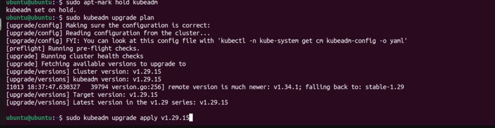
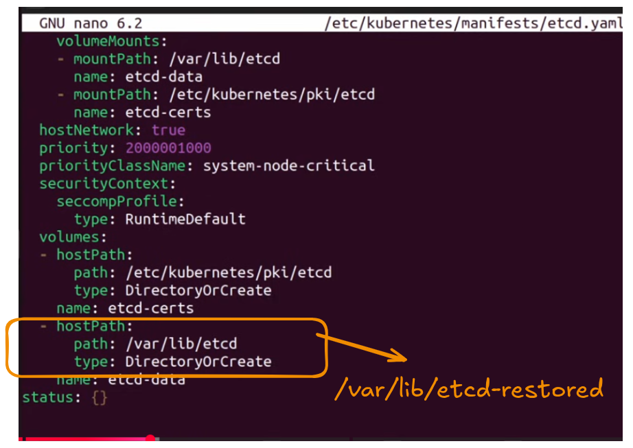
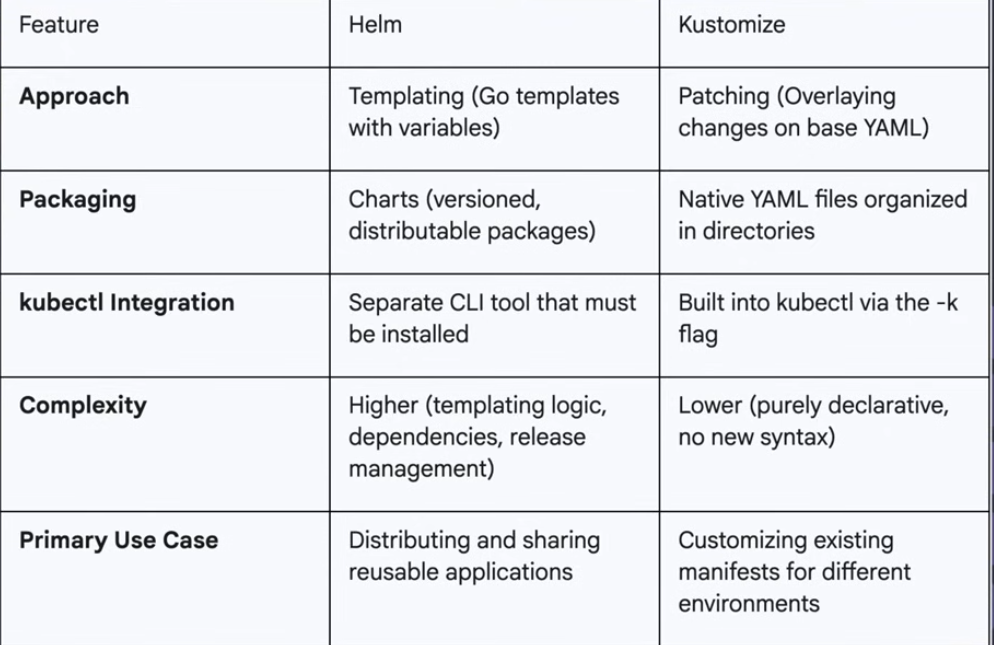

## NOTE 
Working with the kuberbenete admins in order to administrate all the kubernetes related concepts 
- Video that I follow: 
    - https://www.youtube.com/watch?v=Fr9GqFwl6NM


### Some prerequsites for this 
- A Compactible Linux HOSTS (ex. Ubuntu 22.04)
- At least 2GiB of RAM per machine
- At Least 2CPUS for the control-plane nodes
- Full network connectivity between all machines 

#### 1. Install the container run time 
- Kubernetes require containers runtime to run on each node inorder to setup the cluster that can work together. ex.  containerd , crio
- Load required kernel modules, Kubernete networking requied relies on the kernel's ability to see bridge traffic.  
```bash 
cat <<EOF | sudo tee /etc/modules-load.d/k8s.conf
overlay
br_netfilter 
EOF 
```
> This command serve two main purposes: 
> - This file inside this directory will load during boot 
```bash 
sudo modprobe overlay
sudo modprobel br_netfilter
# br_netfilter: allow the kernel to correct process the network packet. 

# running this so that the modules don't need to reboot to start this
```

- Configure CIS control for networking , the next setting ensure the ITP tables correctly processes bridge traffic which is important kube-proxy and CNI plugins 

```bash 
cat <<EOF | sudo tee /etc/sysctl.d/k8s.conf
net.bridge.bridge-nf-call-iptables =1 
net.bridge.bridge-nfs-call-ip6tables =1
net.ipv4.ip_forward =1 
EOF 
```
- to avoid having to restart our machine, we can reload it by `sudo sysctl --system`
```bash 
sudo apt-get install -y containerd 
sudo mkdir -p /etc/containerd
sudo containerd config default | sudo tee /etc/containerd/config.toml


sudo sed -i 's/SystemdCgroup=false/SystemdCgroup = true/' /etc/containerd/config.toml

sudo systemctl restart containerd 

```
- the kubelete and container-runtime , must used to same cgroup driver in order to work properly ( properly managed the resources limits )


#### 2. Install the kubelet,kubectl
```bash 
sudo swapoff -a 
# to make the swapoff persistent

sudo sed -i '/ swap / s/^\(.*\)$/#\1/g' /etc/fstab 
sudo apt-get install -y  apt-transport-https ca-certificates curl gpg 

sudo mkdir -p -m 755 /etc/apt/keyrings 
# curl to download keyrings 
# echo "deb [signed-by=/etc/apt/keyrings...] for telling where to get the kubernetes 

# kubectl 
curl -LO "https://dl.k8s.io/release/$(curl -L -s https://dl.k8s.io/release/stable.txt)/bin/linux/amd64/kubectl"

# kubeadm 
curl -LO "https://dl.k8s.io/release/$(curl -L -s https://dl.k8s.io/release/stable.txt)/bin/linux/amd64/kubeadm"


# kubelet 
curl -LO "https://dl.k8s.io/release/$(curl -L -s https://dl.k8s.io/release/stable.txt)/bin/linux/amd64/kubelet"


```bash
sudo apt-mark hold kubelet kubeadm kubectl 
```
- Used in order to mark the upgrade in order to prevent updgrade. 
- Create a single cluster node 
```bash 
sudo kubeadm init --pod-network-cidr=10.244.0.0/16
mkdir -p $HOME/.kube 
sudo cp -r /etc/kubernetes/admin.conf $HOME/.kube/config 
sudo chown $(id -u):$(id -g) $HOME/.kube/config 

# removing the taints 
kubectl taint nodes \
    --all node-role.kubernetes.io/control-plane-


# for adding the flannel network 
kubectl apply -f https://github.com/fannel-io/fannel/releases/latest/download/kube-flannel.yml 
# without this the pod cannot communicate with each other , and coredns won't be working properly 


# to verify if you are setting it properly 
kubectl get nodes 
kcetl get pods -n kube-system 

```
- A little bit more 
```bash

# tear down the cluster that we have set 
sudo kubeadm reset -f 
# show the ip address of your machine 
hostname -I | awk '{print $1}'
# his IP = 102.168.1.158 

sudo kubeadm init --pod-nework-cidr=192.168.0.0/16 \
    --apiserver-advertise-address=192.168.1.158 

# Use the control plane IP address for this

kubeadm join worker-ip:6443 --token <token> \
    --discovery-token-ca-cert-hash sha256:..... 

```
> When you first install and init it , the status of the master will be NotReady as it lacks to the network plugins 
- Installing the Container Network INterface called calico  \
```bash 
curl -O https://raw.githubusercontent.com/projectcalico/calico/v3.28.3/manifests/calico.yaml
```
- you will need to edit the file called `calico.yaml`, and modify the file based on your requirements 
```yaml 
- name: CALICO_IPV4POOL_CIDR
  value: "10.244.0.0/16"
```

### Working from the Worker Node 
- Join the master by running the command 
```bash 
sudo kubeadm join masterip:6443 --token <token> \
    --discovery-token-ca-cert-hash sha256:token...


# to test it from the master side 
kubectl get nodes -o wide
```
- Admin play important role in keeping the lifecycle of the kubernetes cluster such as maintain the state, upgrading the clusters 
- Process must be done carefully, we will upgrade the master first to ensure workload availability. 

```bash
sudo apt-mark unhold kubeadm 
sudo apt-get update && sudo apt-get install -y kubeadm='1.29.1-1.1' 
sudo apt-mark hold kubeadm 

# check the possibility for the upgrade on the worker nodes
sudo kubeadm upgrade plan 
```

```bash 
sudo kubeadm upgrade apply v1.29.15 
```
- Upgraded kubelet , and kubectl 
```bash

# worker node 

sudo apt-mark unhold kubelet kubectl 
sudo apt-get update && sudo apt-get install -y kubelet='1.29.1-1.1'
sudo apt-mark hold kubelet kubectl 

# to restart the kubelete 
sudo systemctl daemon-reload 
sudo systemctl restart kubelet 


# safely evict all the workload from the worker 1 
kubectl drain k8s-worker-1 --ignore-daemonsets 
# to allow the worker to be running tasks 
kubectl uncordon k8s-worker-1 


sudo apt-get install -y etcd-client 
sudo mkdir -p /var/lib/etcd-backup 

# this command save the snapshot of the 
sudo ETCDCTL_API=3 etcdctl snapshot save /var/lib/etcd-backup/snapshot.db \
    --endpoints=https://127.0.0.1:2379 \
    --cacert=/etc/kubernetes/pki/etcd/ca.crt \
    --cert=/etc/kubernetes/pki/etcd/server.crt \
    --key=/etc/kubernetes/pki/etcd/server.key


sudo ETCDCTL_API=3 etcdctl snapshot restore /var/lib/etcd-backup/snapshot.db --data-dir /var/lib/etcd-restored 

sudo apt-get install -y nano 
# editing the configuration that you have snapshots 

sudo nano /etc/kubernetes/manifests/etcd.yaml 
sudo systemctl start kubelet
```



## Seting up the HA Control Plane 
- A single control-plane node is a single point of failure
- An HA setup uses multiple replicated control-plane nodes and an external load balancer 
- **Kubeadm supports two ways** 
    - **stacked control plane** : 
        all ETCD members are collocated on the control plane , simplier to setup and common in CKA scenarios 
    - external etcd 


- External load balancer, use the private IP and TCP to run a healthcheck on the healthy kubernetes api server 
```bash 
suod kubeadm init \
    --control-plane-endpoint "192.168.1.156:6443" \
    --upload-certs \
    --apiserver-advertise-address 192.168.1.159 

# like before , it will show the command to join the master nodes and the worker nodes 
```


- **Role-based access control** : Build on the 4 keys object
    1. **Role**: A namespaced set of permission 
    2. **ClusterRole**: A cluster-wide (non-namespaced) set of permissions 
    3. **RoleBinding**: Grants a role to a user , group or serviceaccount within a namespace 
    4. **ClusterRoleBinding**: Grant clusterRole to subject in a clusterwide. 


**HELM** package manager for the kubernetes 
```bash 
helm install my-nginx bitnami/nginx \
    --set service.type=NodePort 
```
- `--set`: used to override the default values of the helm chart 

**Kuztomize**: 
While helm used templating language, Kustomize takes things differently as template-free approach 
- Allows you to define the common set of base YAML files and then apply layer of customizations 
- Create the base configuration 
```bash
mkdir -p my-app/base 

cat <<EOF > my-app/base/deployment.yaml 
apiVersion: apps/v1
kind: Deployment 
metadata: 
    name: my-app 
spec: 
    replicas: 1 
    selector: 
        matchLabels: 
            app: my-app 
    template: 
        metadata: 
            labels: 
                app: my-app 
        spec: 
            containers: 
                - name: nginx 
                  image: nginx:1.25.0
EOF 


cat <<EOF > my-app/base/kustomization.yaml 
resources: 
- deployment.yaml 

EOF 

mkdir -p my-app/overlays/production 
cat <<EOF > my-app/overlays/production/patch.yaml 
apiVersion: apps/v1
kind: Deployment
metadata: 
    name: my-app
spec: 
    replicas: 3 
EOF 
```
> Kustomize will merge this this into our base configuration 

```bash 
cat <<EOF > my-app/overlays/production/kustomization.yaml 
#bases: 
resources: 
- ../../base 
patches: 
- path: patch.yaml 
EOF 

```
Run this command 
```bash 
kubetl apply -k my-app/overlays/production
# if you want to exit  the configuration 
kuztomize edit fix 
```
- Differences between the Helm and Kustomized 


## Extending the kubernetes (Extension interface )
- CRI (Container Runtime Interface ): Decouples kubernetes from a specific container runtime 
- CNI (Container Network Interface ): Allow different networking solutions to provide Pod networking 
- CSI (Container Storage interface ) : A standard for exposing storage systems to containerized workloads. 

### CRDs and Opera tors
- **Custom Resource Definition (CRD )**: Allows you to extend the kubernetes API with your own custom resouce types (ex. Database Object )
- **Operators**: A Custom controller that uses CRDs to manage applications and automate complex operational tasks like backup, failover, and upgrade. 


## TroubleShooting 
A structural approach 
1. Identify the problem 
2. Gather information 
3. Analyze the Data
4. Implement a Solutions 
5. Verify the solutions 