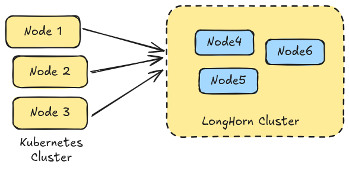

## NOTE for backing up data in longhorn 

In longhorn, "Backups" are sent to separate storage (like S3 or a different NFS share) while "Snapshots" stay on the cluster for quick reverts. 

1. ### Set the "Backup Target" 
First, Longhorn needs to know where to sedn the data. This usually an external locations. 
- UI> Setting > General > Backup Target fields 
- Enter your external storage URL 
    - NFS : `nfs://<IP_ADDRESS>:/path/to/backup`
    - S3: `s3://bucket-name@region/`
        - it requires a kubernetes secret for the credentials 1

2. ### Manual Backup (The "Safety First" Approach )
- If you are about to do a risky update to an app, you can trigger a backup manaully. 
    - In the Longhorn UI, go to the Volume Tabs 
    - Click the nam eof the volumne you want to backup 
    - Click Snapshofts and Backups 
    - Click Take snapshoot(This creates a point-in-time image on your cluster nodes )
    - Select that snapshot and click Backup(this uploads the data to your external cluster. )

3. ### Automatic set and format 
- Setting inside the `Recurring Jobs`
- Create it with the description as below: 
     - name: `daily-offsite-backup`
     - task: `backup` -> this will send to NFS or S3 target 
     - cron: `0 2 * * *`(This run every night at 2:00AM)
     - Retain: 7 ( Keeps the last 7 days of backups; old one are auto-deleted )

