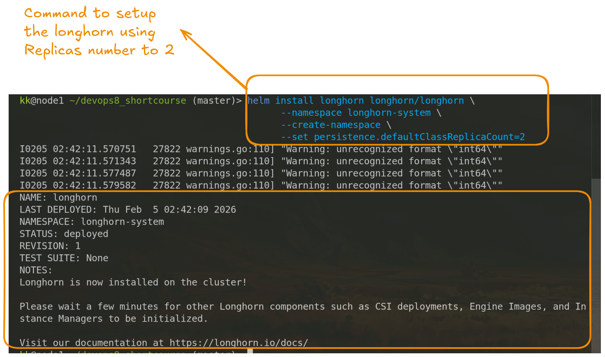
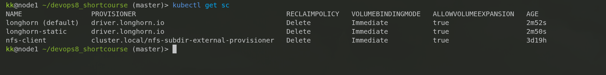

## Working with LongHorn Storages 
Date: 5-Feb-2026

Cloud Native distributed block storage for Kubernetes 
Easy to use, 100% open source , run anywhere. 


## Features 
- ### Highly available persistent storage for Kubernetes 
    - ITOps and DevOps have found it hard to add replicated storage to K8s Cluster. 
    - External Storage arrays are non-portable and can be extermemly expensive 
- ### Easy incremental snapshots and backup 
    - Longhorn's built-in incremental snapshots and backup featrues keep the volume data safe in or out of kubernetes cluster. 
    - Scheduled backups of persistence storage volumes in kubenretes cluster is simplified with Longhorn's intuitive , free manamagenet UI     
- ### Cross-cluster disaster recovery 


## SEtting up
1. Requirement
Longhorn required `open-iscsi` to be installed on every node (masters and workers ) because it use the `iSCSI` protocol to mount the volumes.  

Run this on the five nodes 
```bash 
sudo apt update && sudo apt install -y open-iscsi 
sudo systemctl enable --now iscsid 
```

2. Installation with HELM 
- add the repository 
```bash 
helm repo add longhorn https://charts.longhorn.io
helm repo update
```

- install longhorn 

Because we have 3 master/2 workers setup, we have two choices
1. Strict Storage: Only use the 2 workers for storage. We must set our default replicas count to 2 
2. Full Resillience:  Allow storage to run on masters too. This gives you 5 nodes to play with, allowing the default 3 replicas. 

> It's recommend to use 2-worker setup: Below command installs Longhorn and tell that, by default, it should only make 2 copies of our data (since we only have 2 workers )
```bash 
helm install longhorn longhorn/longhorn \
  --namespace longhorn-system \
  --create-namespace \
  --set persistence.defaultClassReplicaCount=2
```



### 3. Using Longhorn instead of NFS
NFS, we are typically manually create the path and mount it. In longhorn , we don't really need any of that; we just ask Kubernetes for it using `PersistentVolumeClaim`. 

The Storage Class
Longhorn automatically creates a `StorageClass` named `longhorn`. This acts as the `template` for our drive. 

Example: Creating a 10GB Drives 
Instead of configuring an NFS export, you apply this YAML 
```yaml 
apiVersion: v1 
kind: PersistentVolumeClaim
metadata: 
    name: my-disk-claim
spec: 
    accessModes: 
    -  ReadWriteOnce
    storageClassName: longhorn # Use the Longhorn Drive 
    resources: 
        requests: 
            storage: 10Gi

```
Using it in a pod 
```bash 
apiVersion: v1
kind: Pod
metadata:
    name: my-app 
spec: 
    containers: 
    - name: web-server
      image: nginx
      volumeMounts: 
        - name: data-volume 
          mountPath: /usr/share/nginx/html 
    volumes: 
        - name: data-volume 
          persistentVolumeClaim: 
            claimName: my-disk-claim # this match the name above 
```

#### Key Differences from NFS 
| Features | NFS | Longhorn |
|--|--|--|
|Type| File Storage (Shared) | Block Storage (Disk)|
|Performance| Slower(Network Overhead) | Faster (Direct Block access)|
|Redundancy| Usually 1 Server (SPOF )| Distributed (Copies on multiple nodes )|
|Multi-nodes access | Easy(ReadWriteMany) | Require extra confnig (NFS-v4 bridge )|


#### Accessing the UI 
Longhorn comes with great dashboard. You can access it by port-forwarding 
```bash 
kubectl port-forward -n longhorn-system \
    svc/longhorn-frontend 8080:80 
```
- Then go to localhost:8080 to see your disks , health, and backup 

> **NOTES** 
> Longhorn defaults to `ReadWriteOnce` (one pod at a time ). If you need multiple pods to read/write to the same folder (like nFS ), you must enabled the RWX features in the longhorn UI, which internally spins up a small NFS server for that specific volumes. 

*** 
