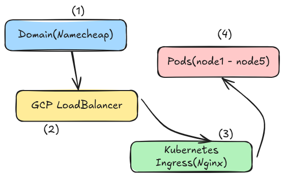

## NOTE for working with theload balancers 



Google Cloud Load Balancer only works automatically with: 
- GKE
- or VM instance groups 
> If your kubernetes cluste ris self-installed on VMs, GoogleCloud LoadBalancer cannot automatically tracks pod health.  

Kubernetes that we installed on google cloud is called 
Self-Managed Kubernetes 

### ✅ What DOES work in our setup 
You can use: 
- Google TCP Load Balancer 
- Google HTTP(s) Load Balancer ( with more manual steps )
> The LB will send the traffic to node ports, not directly to pods 

Domain -> Google Cloud LoadBalancer -> NodePort on each VM -> NGINX ingress Controller -> Kubernetes Services -> Pods 

TCP Load Balancer + NodePort 

- Step1: Expose NGINX Ingress as NodePorts
```yaml 
apiVersion: v1
kind: Service 
metadata: 
    name: ingress-nginx-controller 
    namespace: ingress-nginx 
spec: 
    type: NodePort 
    ports: 
        - name: http
          port: 80 
          targetPort: 30080
        - name: https 
          port: 443 
          targetPort: 443 
          nodePort: 40443 
    selector: 
        app.kubernetes.io/name: ingress-nginx 
```

- Step 2: Create Instance Group
All your kubernetes nodes must be in one unmanaged instance group 
```bash 
gcloud computer instance-groups unmanaged create k8s-nodes 
# add nodes 
gcloud compute instance-groups unmanaged add-instances k8s-nodes \
    --instances node1,node2,node3,node4,node5 \
    --zone asia-southeast1-a 


# Create a health check 
gcloud compute health-checks create tcp k8s-health-check \
    --port 30080 


# Create backend service 
gcloud computer backend-services create k8s-backend \
    --protocol TCP \
    --health-checks k8s-health-check \
    --global 


# Attach instance group 
gcloud compute backend-services add-backend k8s-backend \
    --instance-group k8s-nodes \
    --instance-group-zone asia-southeast1-a \
    --global


# create forwarding rule ( public ip )
gcloud computer forwarding-rules create k8s-lb \
    --load-balancing-scheme EXTERNAL \
    --ports 80 \
    --backend-service k8s-backend \
    --global # this will give you one ip 
```


